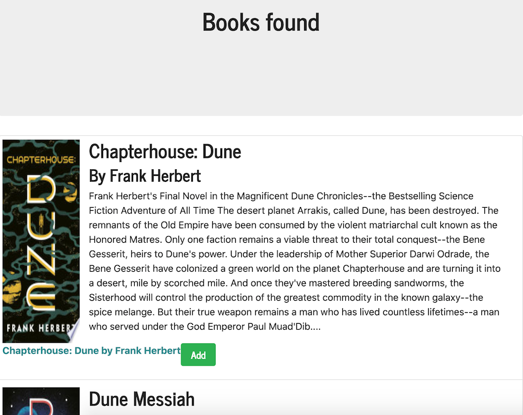
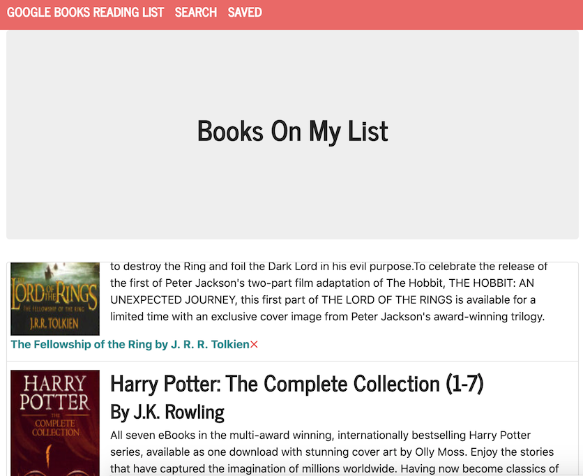

# React Google Books 
  Search and save books with googleboks API, React and Mongo.
  # Table of Contents
  1. [Installation](#installation)
  2. [Usage](#usage)
  3. [Detailed Description](#detailed-description)
  4. [License](#license)
  5. [Contribution Guidelines](#contribution-guidelines)
  6. [Questions](#questions)
## Installation
To install please use: 
`npm i`
## Usage
To use locally do next: 
`npm start`
## Detailed description
App created using React library and Mongo database. Application deployed on [heroku](https://olgas-google-books.herokuapp.com/).
You can search books by title and save them to database

You can delete book from saved books

## License
[License: MIT](https://opensource.org/licenses/MIT)
## Contribution Guidelines 
No contribution needed at this time
## Questions
For questionts please contact [me](https://github.com/Myau5x) at ola.illari@gmail.com
 

